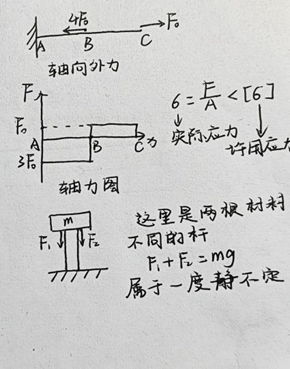
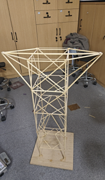

---
tags:
  - 能环
  - 慧能
---

# 工程力学

## 课程内容

### 先修要求
- 高等数学

### 分数构成

- 线下考核70%：平时作业占10%，出勤和课堂表现占5%，学习体会小论文占5%，期末考试50%；

- 线上考核30%：相关补充材料和视频观看占5%，线上讨论占10%，结构设计并二级加载成功占15%。

### 课程大纲

- 理论力学部分
- 材料力学部分

## 任课教师

=== "吴昌聚"

=== "吴禹"

=== "朱林利"

=== "李华"

## 课程资源

### 推荐教材/网课
- **《工程力学》吴昌聚 浙江大学出版社** 2023年出版
- 《工程力学》[**MOOC网址**](https://www.icourse163.org/course/ZJU-1206446837?from=searchPage)

### 资源文件

- [**工程力学**](https://pan.baidu.com/s/1f3eKOC3FtTdZkT_U_cwbkg?pwd=7vdp)

### 学习笔记

=== "徐静远"

    

    

    <object data="Engineering Mechanics.pdf" type="application/pdf" aria-labelledby="PDF document">
        <embed src="Engineering Mechanics.pdf" type="application/pdf" />
        

            Your browser does not support PDFs
            <a href="Engineering Mechanics.pdf" class="image fit">下载笔记</a>
        

    </object>

    

## 学习建议

=== "纸鹤"

    我是2024秋冬修的《工程力学》这门课（吴老师上课），综合考评拿了98分。

    就我的学习体验来说，在材料力学基础这一章之前，都可以把工程力学当作物理学来学；但到了后面拉伸、扭转等部分，就需要转变心态，多下些功夫了。

    学习《工程力学》，必须明白以下概念：约束分类和约束力、静定与静不定、拉应力与切应力、强度和刚度检验与设计、内力图。这些概念是贯穿整本书的底层逻辑。彻底弄清这些概念后，就可以一一代入那四类情况：拉压、扭转、弯曲、失稳。

    这里以拉压（轴向拉伸和压缩）来举例：

	拉压一般不考虑杆的自重，约束反力只有轴向外力；内力图只有力，没有矩；强度检验要求实际应力小于许用应力（有时要考虑安全系数问题）；还有某些静不定问题：

    

    （几度静不定代表缺少几个方程，这里是两个未知量一个方程，所以是一度静不定问题。要想解决静不定问题需要列补充方程，而补充方程往往是与材料的实际性能有关的。这里还可以补充一个变形方程，即两个杆件的压缩变形量是相同的，这样就可以分别解出F1和F2了。）

    其他三种情况也根据上面说的那些概念来一点点分析，很快就可以把所有知识点梳理一遍，简单方便。

    此外，《工程力学》课程的小组手工制作环节让人记忆非常深刻。一开始刚刚组好队的时候基本上大家都不认识，也不知道到底该如何搭建木塔，只能一点点尝试，一步步修正。而搭建木塔的过程让我们开始思考材料的结构与作用，让我们开始运用课堂上学到的力学知识。成员们有时会为了主梁的木材数量争论，有时会因胶水不够而发愁，有时又因为进度比其他组更快些而喜悦......这样的点点滴滴，贯穿于冬2周到冬6周。累计十几个小时的共同努力，最终的木塔（如下图）看上去有了那么点意思，成功经过了老师的一级加载和二级加载，最终拿到了小组实践环节的满分。

    

    如今看来，我觉得《工程力学》这门课绝对是大学课程中很有学习意义的一门课，不仅仅是工程上的运用，更有生活中的启示。

    最后夹杂点私货，说说考试大概会考的大题题型：第一类：静力学（约束反力）+剪力、弯矩图；第二类：弯曲正应力（强度校核）（这里可能会涉及微积分，计算较为复杂）；第三类：复杂应力状态+第一、二、三、四强度理论校核强度；第四类：压杆稳定+弯曲变形（静定与静不定）。在学习时和最后复习时可以着重于这些点，会更有效率一些。

    最后祝大家都能收获自己满意的成绩！

