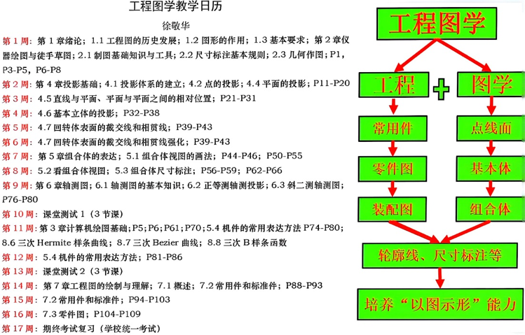

---
tags:
  - 能环
  - 车辆
  - 过控
  - 慧能
---

# 工程图学

## 课程内容

### 分数构成

平时20% + 阶段测验20% + 考试60%

### 课程大纲

## 课程资源

### 推荐教材/网课

- [**Savia的网站**](https://savia7582.github.io/Exterior/Engineering/graphics/)

### 资源文件

- [**工程图学**](https://pan.baidu.com/s/1MjBWuIVlYb5VZVVkKSw6rg?pwd=vkcj)

### 学习笔记

## 学习建议

