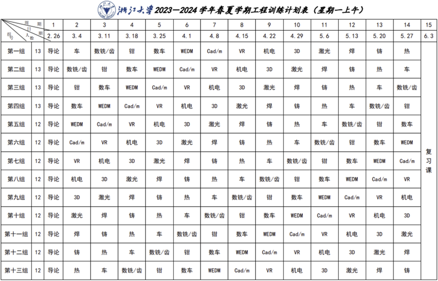

---
tags:
  - 能环
  - 车辆
  - 过控
  - 慧能
---

# 工程训练

## 课程内容

可参考[力速双A](https://fsaa.pages.zjusct.io/fsaa/courses/MajorFoundation/EngineeringTraining/)

### 分数构成

**2025年取消期末考试**

### 课程大纲

## 课程资源

### 推荐教材/网课

### 资源文件

- [**工程训练**](https://pan.baidu.com/s/1UYeHjuexi3RKcADcaYULMg?pwd=jsue)

### 学习笔记

## 学习建议

