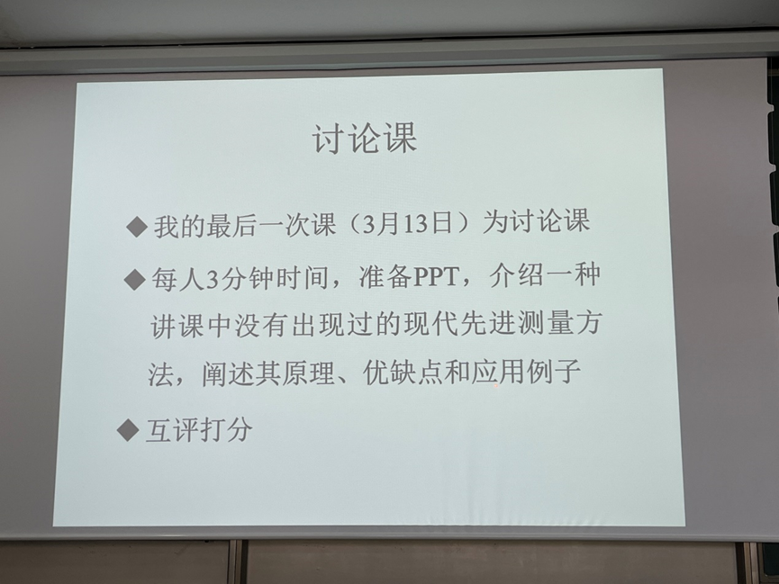

---
tags:
  - 能环
  - 新能源
---

# 新能源系统检测与控制

## 课程内容

### 分数构成

平时（30-40），期末闭卷（60-70）

分为王飞老师和黄群星老师两个人上（各上8节课），王飞每节课会留思考题（作业），期末会考这些题，第四周结束时统一一起交；王飞老师的左后一节课是展示课，个人展示，每人3分钟左右，只用讲一种现代测量技术就行；每节课都会口头点名

展示要求见下图：

### 课程大纲

## 任课教师

=== "王飞/黄群星"

## 课程资源

### 推荐教材/网课

### 资源文件

### 学习笔记

## 学习建议

