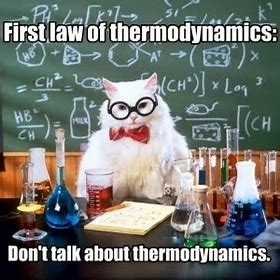

# 欢迎来到源梦紫金！✨

### 💡关于源梦紫金

Hi~😉！

这里是由**浙江大学能源工程学院学生会（ZJUSUEE）**建设的课程攻略共享平台——**「源梦紫金」**

ZJU能院包含能环、车辆、过控等诸多专业，本站即致力于汇总整合ZJU能源学科众多的课程资源，满足能院学子日常学习需要以及度过漫长的考试周🌟

从《工程流体力学》到《传热学》，每一门课程都藏着独特的通关秘籍。我们收集了学长学姐们亲笔撰写的课程锦囊、精心整理的学霸笔记，还有满载实战经验的实验报告模板。就像打开能源世界的多啦A梦口袋，你需要的学习装备，我们早已备好！

欢迎能院的同学（也欢迎其他学院同学）与我们共同建立平台，分享课程资源、笔记等资料，以便今后能源学子能够更为便捷地获取知识！

!!! info "特别致谢"

    源梦紫金主要参考[**力速双A**](https://fsaa.pages.zjusct.io/fsaa/)、[**数学之韵**](https://zju_math.pages.zjusct.io/mathweb/)、[**图灵班学习指南**](https://zju-turing.github.io/TuringCourses/)等优秀的友院课程平台建设网站！感谢友院优秀平台的启迪，让我们在求是创新的道路上携手同行。

**以下是一些常用课程资源：**

-   :ocean:{ .lg .middle } __工程流体力学（甲）I&II__

    ---

    { width="250" }
    /// caption
    [**工程流体力学（甲）I&II**](./courses/public/fundamental/工程流体力学（甲）.md)
    ///

-   :simple-steam:{ .lg .middle } __工程热力学（甲）__

    ---

    { width="250" }
    /// caption
    [**工程热力学（甲）**](./courses/public/professional/工程热力学（甲）.md)
    ///

-   :fire:{ .lg .middle } __传热学（甲）__

    ---

    { width="250" }
    /// caption
    [**传热学（甲）**](./courses/public/professional/传热学（甲）.md)
    ///

-   :mechanic:{ .lg .middle } __工程力学__

    ---

    { width="250" }
    /// caption
    [**工程力学**](./courses/public/fundamental/工程力学.md)
    ///

若想查阅其他课程请点击左侧边栏“**本科课程大纲**”，或在上方直接点击对应专业查询课程

### 🚩召集令

无论是想成为知识海盗发掘宝藏，还是化身能源诗人书写攻略，查阅左侧边栏"**平台贡献指南**"上传你优秀的独到见解~
让我们以知识为燃料，以梦想为反应堆，在浩渺的学术宇宙中，共同推进属于ZJU能院人的光速航行！🔋🚀
**（感谢每一位学长学姐为网站的贡献！我们会为每一份上传的资料注明出处~）**

**如果有任何关于资料侵权的问题，请联系我们！我们会加以修改或撤除**

~~源神启动！~~

本站由**能源工程学院学生会**开发，在使用遇到相关问题请私信**ZJU能小源**微信公众号，或邮箱反馈：ZJUSUEE@163.com，也欢迎私信CC98@淹死的鲸（注明来意）

